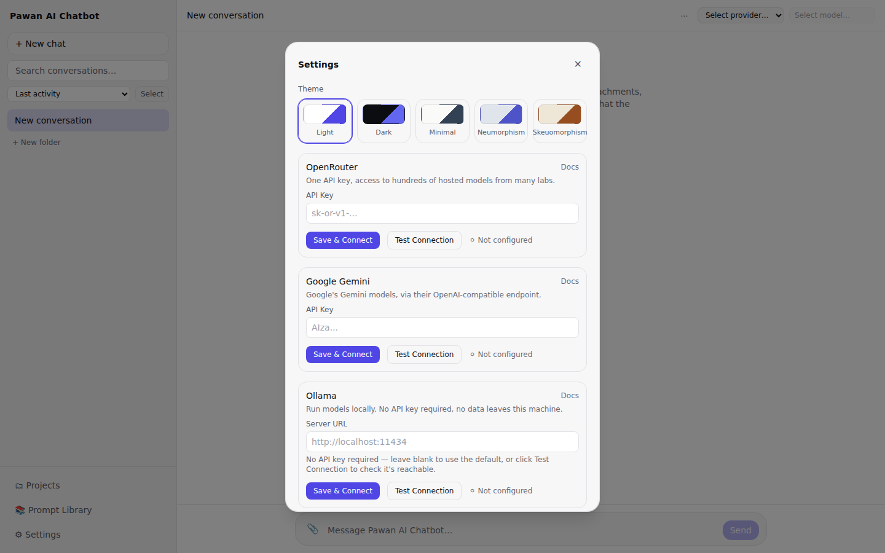
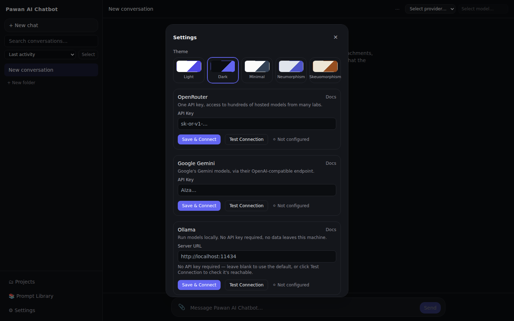
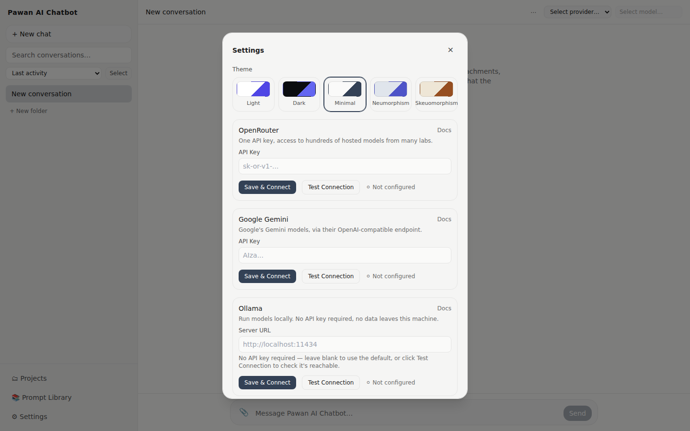
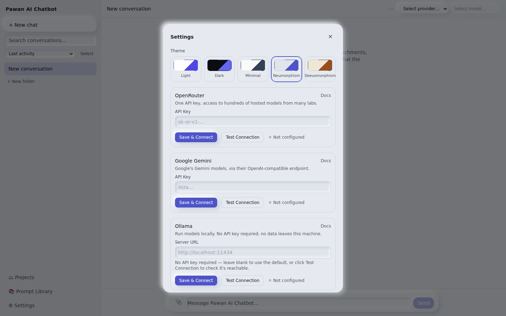
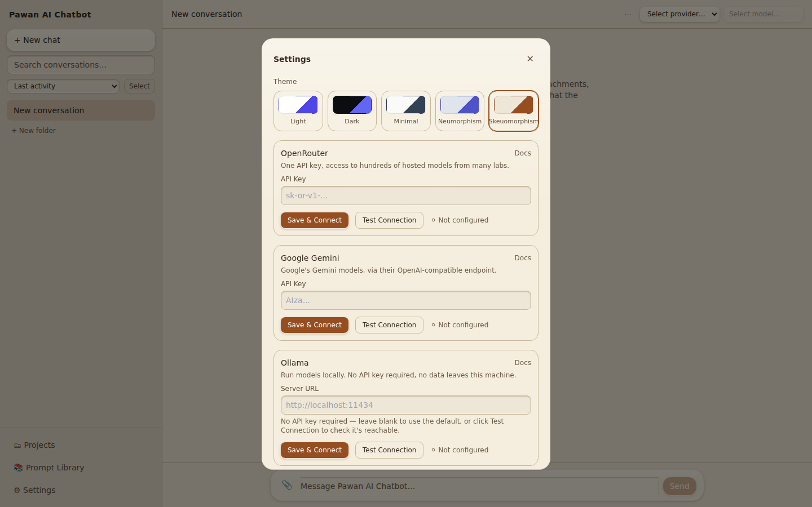
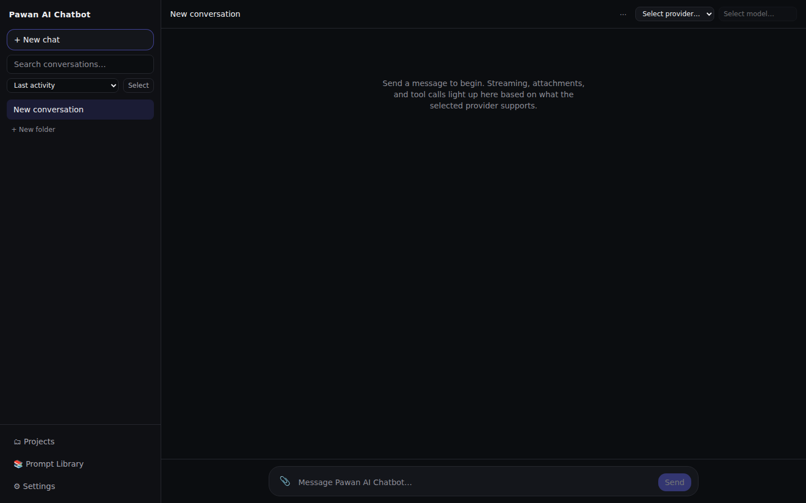
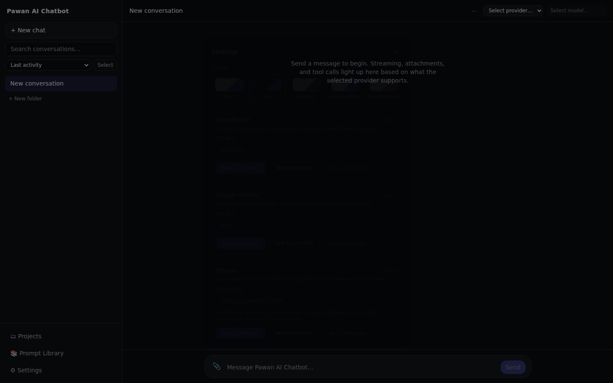
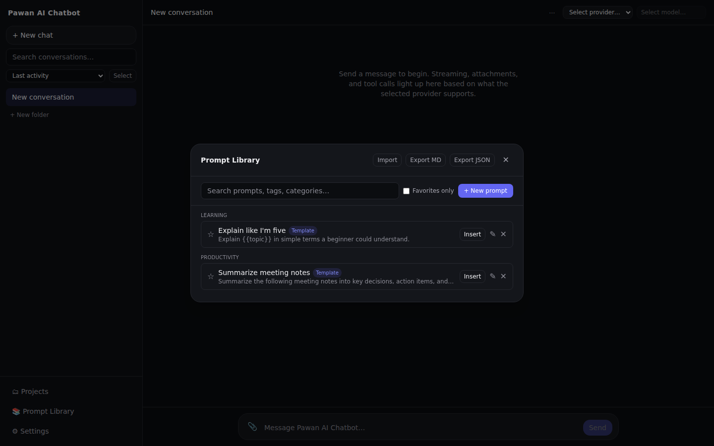
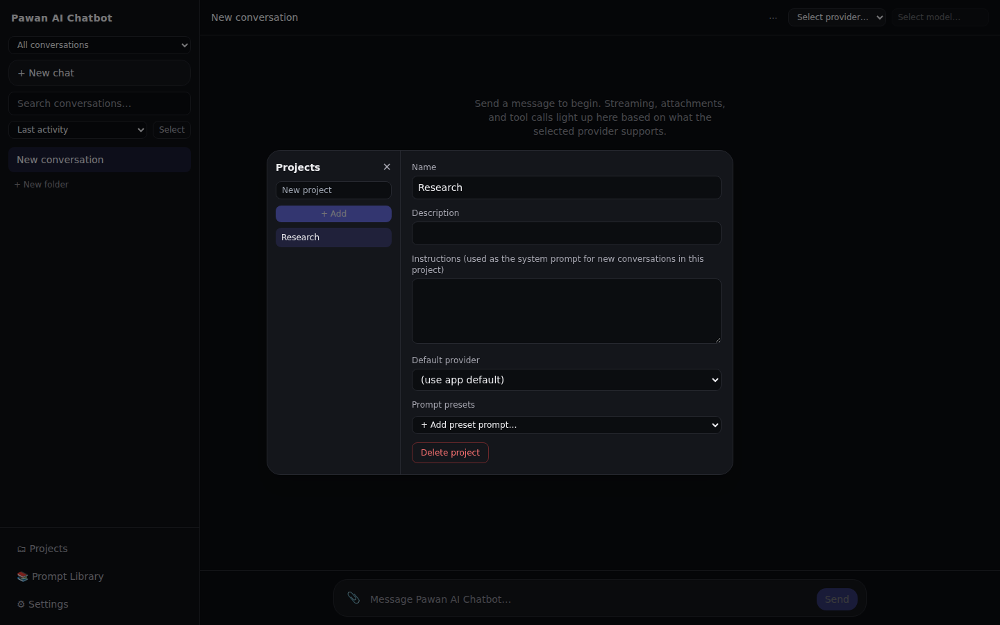
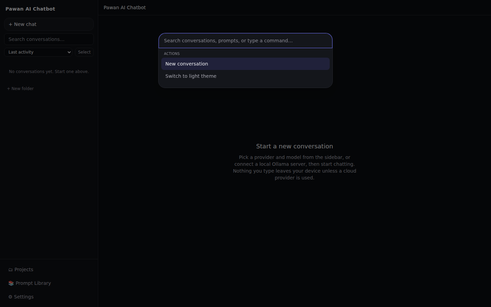

# Pawan AI Chatbot

A local-first, provider-agnostic AI chat client. Bring your own API key (OpenAI-compatible providers, Google Gemini, or Anthropic) or run models locally via Ollama — no login, no mandatory backend, no server-side storage. Your conversations live only in your browser.

## Overview

Pawan AI Chatbot is a web-based AI chat application built to work equally well with local LLMs and configurable API-based providers. There's no account system and no server that sees your data: conversations, prompts, projects, and settings are all stored client-side, and API keys you enter never leave your browser (except to the provider you're talking to). It's designed to be run locally (`npm run dev` / a static production build) rather than as a hosted multi-tenant service.

## Features

- **Multi-provider AI architecture** — one interface, four built-in providers (see [AI Providers](#ai-providers))
- **Local LLM support** via Ollama — no API key required, nothing leaves your machine
- **API-key based providers** — keys are entered in Settings and stored only in your browser
- **Streaming responses** with stop and retry
- **Conversation management** — rename, duplicate, branch (continue from any message), archive, delete
- **Folders and pinning** for organizing conversations
- **Projects** — group conversations under a shared default provider/model and standing instructions
- **Prompt Library** — variables/templates, tags, version history, favorites
- **Prompt import/export** — JSON and Markdown
- **File attachments** — with real per-provider capability checks (see [AI Providers](#ai-providers))
- **Conversation statistics** — message/character/token counts, attachments, provider, timestamps
- **Search** across conversations, prompts, projects, and generated artifacts
- **Command Palette** (`Cmd/Ctrl+K`) for quick navigation and actions
- **Keyboard shortcuts** for the essentials
- **Persistent settings/conversations** — IndexedDB, with automatic fallback to localStorage and then in-memory
- **Five themes** — Light, Dark, Minimal, Neumorphism, Skeuomorphism
- **Accessibility** — keyboard navigation, focus management, computed WCAG AA contrast, screen-reader-friendly live regions
- **Export** — single or multiple conversations, whole projects, or the Prompt Library, as Markdown, JSON, or ZIP
- **Responsive UI** — usable sidebar/composer behavior down to mobile widths

## AI Providers

Providers are implemented against one `ChatProvider` interface — the UI never branches on which provider is active. Four are registered out of the box:

| Provider          | Requires API key | Local | Notes                                                                                                         |
| ----------------- | ---------------- | ----- | ------------------------------------------------------------------------------------------------------------- |
| **OpenRouter**    | Yes              | No    | Access to many hosted models through one key                                                                  |
| **Google Gemini** | Yes              | No    | Google's Gemini models via their OpenAI-compatible endpoint                                                   |
| **Anthropic**     | Yes              | No    | Claude models, native streaming API. **The only provider that currently supports image attachments** (vision) |
| **Ollama**        | No               | Yes   | Points at a local Ollama server (default `http://localhost:11434`, configurable). No data leaves your machine |

**On attachments:** the composer accepts file attachments generally, but each provider declares what it actually supports. Right now, only Anthropic declares image (vision) support, and no provider declares document/PDF support — attaching a document, or an image to any provider other than Anthropic, is flagged as incompatible in the UI rather than silently sent and ignored. This is a genuine capability limitation of the current provider adapters, not a UI restriction.

## Themes

Five themes, selectable from **Settings → Theme**: **Light**, **Dark**, **Minimal**, **Neumorphism**, and **Skeuomorphism**. Switching is instant and requires no reload; your choice is persisted and restored on your next visit.

## Screenshots

All screenshots below were captured from the actual running application.

### Themes

| Light                                            | Dark                                           |
| ------------------------------------------------ | ---------------------------------------------- |
|  |  |

| Minimal                                              | Neumorphism                                                  | Skeuomorphism                                                    |
| ---------------------------------------------------- | ------------------------------------------------------------ | ---------------------------------------------------------------- |
|  |  |  |

### Product

|                                                                                |                                                                               |
| ------------------------------------------------------------------------------ | ----------------------------------------------------------------------------- |
| **Main chat interface**  | **Settings / providers**  |
| **Prompt Library**       | **Projects**                        |
| **Command Palette**    |                                                                               |

## Installation

```bash
git clone <this-repository-url>
cd power-ai-chatbot
npm install
npm run dev
```

The dev server prints a local URL (default `http://localhost:5173`) — open it in a browser.

## Production Build

```bash
npm run build      # type-checks (tsc -b) then builds via Vite into dist/
npm run preview    # serves the dist/ build locally, to verify it before deploying
```

`dist/` is a static site — deploy it to any static host (it does not need a Node server at runtime).

## Configuration

No environment variables are required to run the app — API keys are entered in-app (**Settings**) and stored only in your browser's IndexedDB/localStorage, never in a config file or on a server.

An `.env.example` is included for one optional exception: if you deploy the optional serverless proxy in `functions/anthropic-proxy/` (used to call Anthropic directly from the browser, which requires a CORS-friendly proxy), it forwards your own key from a request header — see that folder's own docs for its deployment-specific variables. The main application itself needs none.

## Local LLM Setup

1. Install and run [Ollama](https://ollama.com) locally, and pull at least one model (e.g. `ollama pull llama3`).
2. In Pawan AI Chatbot, open **Settings**, select the **Ollama** provider, and set the server URL if it isn't the default (`http://localhost:11434`).
3. Select a model and start chatting — no API key needed, and nothing is sent outside your machine.

This targets Ollama's OpenAI-compatible endpoint specifically; other local servers exposing the same `/v1/chat/completions` + `/v1/models` shape will generally also work by pointing the server URL at them, but only Ollama is documented/tested here.

## Keyboard Shortcuts

| Shortcut            | Action                                                                             |
| ------------------- | ---------------------------------------------------------------------------------- |
| `Cmd/Ctrl + K`      | Open the Command Palette                                                           |
| `Cmd/Ctrl + N`      | Start a new conversation (using the active project's defaults, if one is selected) |
| `Esc`               | Close the open dialog/menu                                                         |
| `↑` / `↓` / `Enter` | Navigate and run results within the Command Palette                                |

## Project Structure

```
src/
├── providers/       # ChatProvider adapters (OpenRouter, Gemini, Anthropic, Ollama) + the shared OpenAI-compatible factory
├── chat/            # The send/stream/stop/retry pipeline
├── state/           # Zustand stores (conversations, settings, prompts, projects, attachments)
├── storage/         # Persistence: Dexie (IndexedDB) + localStorage fallback, event-driven auto-save
├── artifacts/        # Extracts code/JSON/table/document artifacts from messages (derived, not stored separately)
├── search/           # Search across conversations, prompts, projects, artifacts
├── export/            # Markdown/JSON/ZIP export
├── prompts/            # Prompt variables/templates, import/export
├── conversations/       # Conversation statistics
├── hooks/                # Shared UI hooks (modal accessibility, theming, debouncing, etc.)
├── components/            # UI, organized by feature (chat, sidebar, settings, prompts, projects, artifacts, command palette)
├── events/                 # The typed internal event bus connecting UI actions to persistence
└── types/                  # Shared domain types
```

## Tech Stack

- **React 19** + **TypeScript**
- **Vite** — build tooling
- **Tailwind CSS** — styling, theme tokens via CSS custom properties
- **Zustand** — state management
- **Dexie** — IndexedDB persistence
- **react-markdown** + **remark-gfm** + **lowlight** — message rendering and syntax highlighting
- **JSZip** — ZIP export (lazy-loaded)
- **Vitest** + **React Testing Library** — unit/component testing
- **Playwright** — end-to-end test infrastructure
- **ESLint** + **Prettier** + **Husky/lint-staged** — code quality tooling

## Testing

```bash
npm test           # Vitest — run once
npm run test:watch # Vitest — watch mode
npm run test:e2e   # Playwright (infrastructure in place; no specs yet)
```

Current verified state: **426 / 426 tests passing**.

## License

MIT — see [LICENSE](LICENSE).

## Changelog

See [CHANGELOG.md](CHANGELOG.md).
